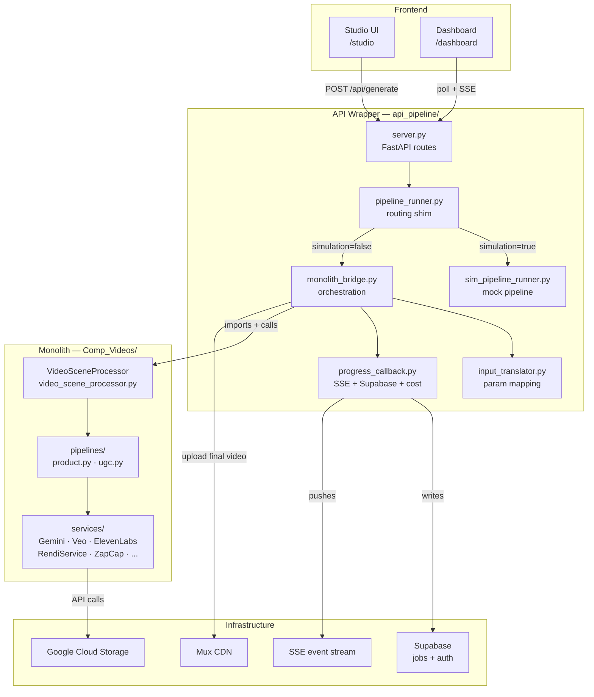
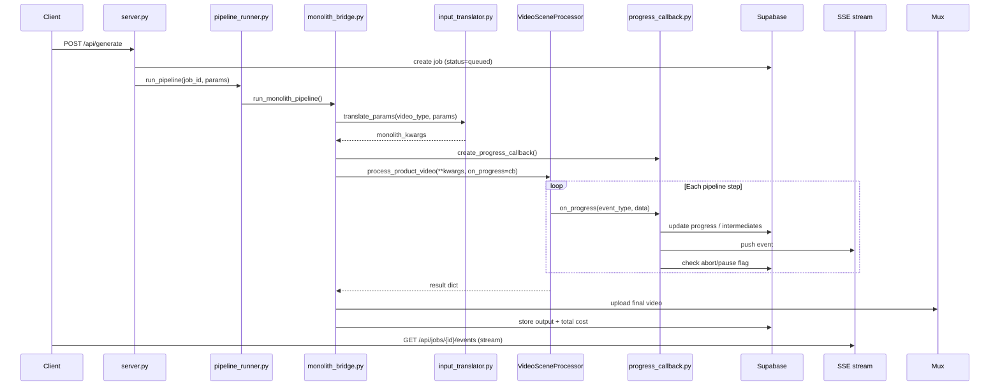
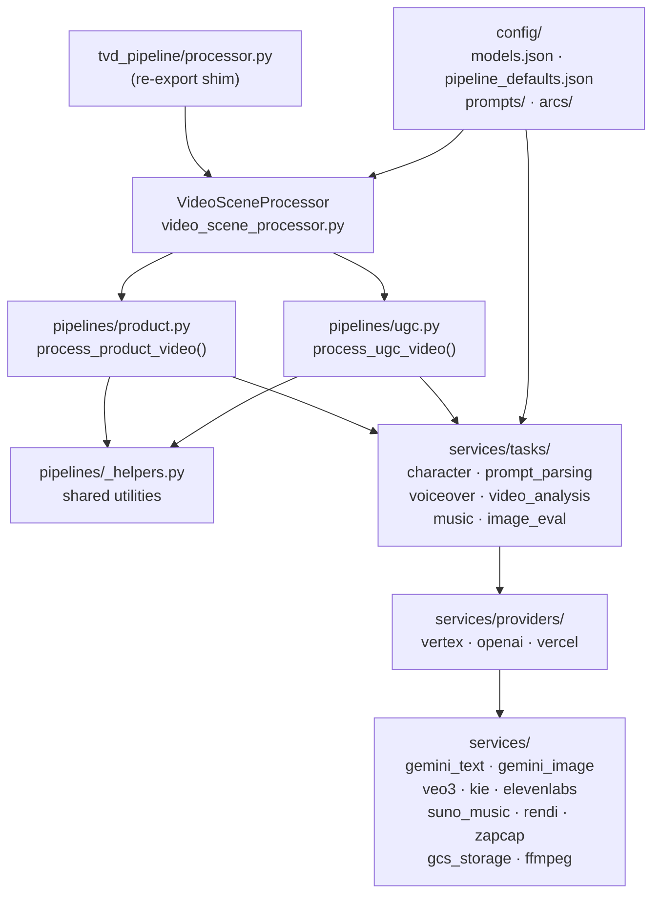

# Architecture

## System Overview

The system is split into two separate codebases that live in the same repository:

- **Monolith** (`Comp_Videos/`) — all video generation logic. Written by the algo engineer. Never contains API or web concerns.
- **Wrapper** (`api_pipeline/`) — thin orchestration layer. Translates API requests into monolith calls and adds infrastructure (Supabase, SSE, Mux, cost, simulation).

The wrapper has **zero pipeline logic**. When `Comp_Videos/` is updated, all pipelines automatically reflect the changes because the monolith is imported and called directly at runtime.



---

## Two Execution Modes

### Mode 1: Google Sheets (monolith standalone)

```
python Comp_Videos/video_scene_processor.py
```

- Reads jobs from a Google Sheet (`Sheet1`). Each row = one job.
- Reads input columns (`Prompt`, `Video type`, `Character`, `Logo`, etc.).
- Writes output back to columns (`TEXT 1–4`, `Scene N`, `RENDI Scene`, `Subtitled Video`, `Final Video`).
- Progress visible as columns fill in real-time in the spreadsheet.
- Entry point: `VideoSceneProcessor().process_all_videos()`

### Mode 2: API Server (wrapper → monolith)

```
POST /api/generate  →  monolith_bridge  →  VideoSceneProcessor
```

- FastAPI receives a JSON POST with the job parameters.
- Wrapper translates API params and calls the monolith's `VideoSceneProcessor` directly.
- An `on_progress` callback bridges monolith events to SSE, Supabase, and cost tracking.
- After the monolith returns, wrapper uploads to Mux and stores the result.

---

## API Request Data Flow



---

## Pipeline Routing

| API `video_type` | Monolith method | `video_subtype` |
|---|---|---|
| `"product video"` | `process_product_video()` | — |
| `"influencer"` | `process_ugc_video()` | `"influencer"` |
| `"personal-brand"` | `process_ugc_video()` | `"personal_brand"` |
| `"UGC-style video"` | `process_ugc_video()` | `"influencer"` (deprecated alias) |
| `"personal-service"` | `process_ugc_video()` | `"personal_brand"` (deprecated alias) |

---

## Pipeline Step Flows

### Product Video

```
parse_prompt → TEXT 1–4
  → (optional) reference video structure analysis
  → scene image prompts
  → Gemini image generation
  → Veo3 / Kling / Runway animation
  → VO script + ElevenLabs TTS
  → Suno music
  → Rendi concat
  → Rendi add VO + music
  → ZapCap subtitles
```

### Influencer

```
generate / describe influencer character
  → parse_prompt → TEXT 1–4
  → analyze reference images
  → scene prompts (influencer-in-scene)
  → Nano Banana / Gemini image gen
  → Veo3 / Kling / Runway animation
  → insert asset clips (max 3s, zoom effect)
  → logo + slogan CTA scene
  → Suno music
  → ElevenLabs TTS (expressive, 0.5s pauses)
  → Rendi concat (0.4s dissolve)
  → Rendi add VO + music
  → ZapCap subtitles
```

### Personal Brand

```
describe characters
  → parse_prompt → TEXT 1–4
  → analyze reference images
  → generate VO with ||| markers (VO-first)
  → pre-split VO + scene prompts (topic-fit alignment)
  → image gen (configurable API)
  → animation
  → Suno music + beat-sync trim
  → Rendi concat (dissolve)
  → Rendi add VO + music
  → ZapCap subtitles
```

---

## Progress Callback Protocol

The monolith calls `on_progress(event_type, data)` throughout execution. The wrapper's callback factory (`progress_callback.py`) handles each event type:

| Event type | Data keys | Wrapper action |
|---|---|---|
| `usage` | `step`, `model`, `provider`, `input_tokens`, `output_tokens`, `duration_seconds` | Compute cost, emit SSE `cost_update`, update Supabase cost |
| `step_start` | `step`, `label` | Emit SSE `step_start`, start timer, update `current_step` in Supabase |
| `step_complete` | `step`, `label`, `progress`, `message` | Update Supabase progress, emit SSE `step_complete`, check `pause_after_step` |
| `intermediate` | `key`, `value` | Merge into Supabase `intermediates` JSONB column |
| `warning` | `message` | Log + emit SSE `warn` |
| `artifact` | `filename`, `content` | Write to `job_artifacts/{job_id}/` |

Before every event, the callback checks `supabase.get_job()` for `aborted` / `paused` flags and raises `JobAbortedError` / `JobPausedError` if set, stopping the monolith cleanly.

---

## Input Translation

`input_translator.translate_params()` maps API request fields → monolith kwargs:

1. **Resolution tier** — `get_tier(output_resolution, pipeline)` from `resolution_tiers.json` → `video_model`, `image_model`, providers.
2. **Override order** — tier defaults < `animation_model` / `image_api` < explicit model fields.
3. **Model mappings** — `animation_model` string → `video_model` + `video_provider` via `model_mappings.json`.
4. **Sync** — `sound_sync_method: "beat_sync"` → `sync_method: "precision"`.
5. **URL lists** — normalizes `character_urls`, `asset_urls`, `product_image_urls`, `reference_image_urls`.

---

## Output Resolution Tiers

Defined in `api_pipeline/config/resolution_tiers.json`. Each tier resolves to a `video_model` and `image_model` per pipeline type. Example tiers: `"720p"`, `"1080p"`, `"4k"`, `"auto"`.

---

## Monolith Internal Structure



---

## External API Dependencies

| Service | Purpose | Provider |
|---|---|---|
| **Gemini** (Vertex AI) | Text generation, scene prompts, reference analysis, image gen | Google |
| **Veo 3 / 3.1** | Image-to-video animation | Google Vertex AI |
| **OpenAI GPT-4o** | Fallback frame analysis, text generation | OpenAI |
| **Kie.ai** | Nano Banana (images), Kling V2.5/2.6 (video), Runway (video), Suno (music) | Kie.ai |
| **Runway Gen4 / 4.5** | Video animation fallback | Runway (via Kie or direct) |
| **fal.ai** | Additional video generation | fal.ai |
| **ElevenLabs** | Text-to-speech voiceover | ElevenLabs |
| **Suno** | Background music generation | Suno via Kie.ai |
| **Rendi.dev** | FFmpeg cloud: trim, concat, dissolve, VO+music mix | Rendi |
| **ZapCap** | Subtitle burn-in | ZapCap |
| **GCS** | Asset storage (bucket: `automatiq`) | Google Cloud |
| **Mux** | Final video CDN hosting | Mux |
| **Supabase** | Job storage, auth, intermediates, cost | Supabase |
| **Vercel AI Hub** | Alternative LLM provider | Vercel |

---

## Frontend UIs

### Studio (`/studio`)

Step-by-step video creation wizard with:
- Supabase authentication (sign up / sign in / sign out)
- Cloud video gallery (browse, play, re-edit past videos)
- File upload to GCS (`POST /api/upload`)
- Phased generation with review checkpoints
- SSE real-time progress display

### Dashboard (`/dashboard`)

Job monitoring and control panel:
- Submit any pipeline type with full parameter control
- Real-time SSE event log and progress bar
- Cost display per step
- Abort / pause / retry / restart controls
- Simulation mode toggle
- Server selector (localhost / remote / custom)

### Playground (`/playground`)

Interactive pipeline flow diagrams for all three pipeline types (read-only).

---

## Simulation Mode

Two simulation flavors:

| Mode | How it works | Use case |
|---|---|---|
| **Wrapper simulation** | `sim_pipeline_runner.py` runs the full step flow using `SimServiceRegistry` (mock services). Never imports the monolith. | UI testing, CI |
| **Monolith simulation** | Real monolith with `simulation=True`. Monolith uses mock API calls internally. | Integration testing |

Routing in `pipeline_runner.py`:

```python
if isinstance(services, SimServiceRegistry):
    return run_simulated_pipeline(...)
return run_monolith_pipeline(...)
```

---

## Docker Setup

- Container: `video-pipeline`
- Port: `8000:8000`
- `api_pipeline/` bind-mounted → `/app/api_pipeline` (live reload via uvicorn `--reload`)
- `Comp_Videos/` bind-mounted → `/app/Comp_Videos` (monolith available at runtime)
- `PYTHONPATH=/app` — makes `tvd_pipeline` importable
- **No rebuild needed** for Python code changes — bind mount + `--reload` picks them up instantly
- Rebuild only when `requirements.txt` or `Dockerfile` changes

---

## Job Lifecycle

```
queued → running → (paused ↔ running) → completed | failed | aborted
```

- `paused` — set when `pause_after_step` matches the completed step, or when user calls `POST /api/jobs/{id}/pause`
- `aborted` — set when user calls `POST /api/jobs/{id}/abort`; callback raises `JobAbortedError` on next check
- `resume` — `POST /api/jobs/{id}/resume` with optional updated `intermediates`; restarts from the next step
- `retry` — `POST /api/jobs/{id}/retry`; re-runs from the beginning (or from a specified step with `restart`)
